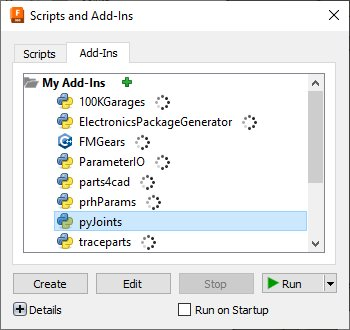
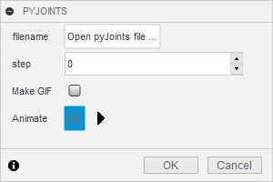
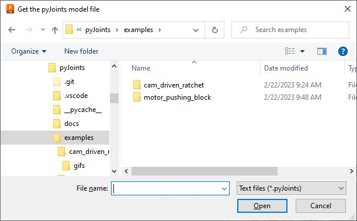
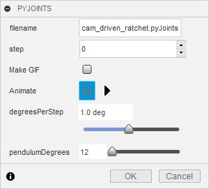
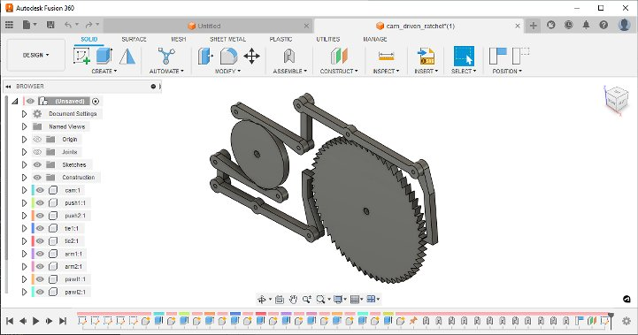
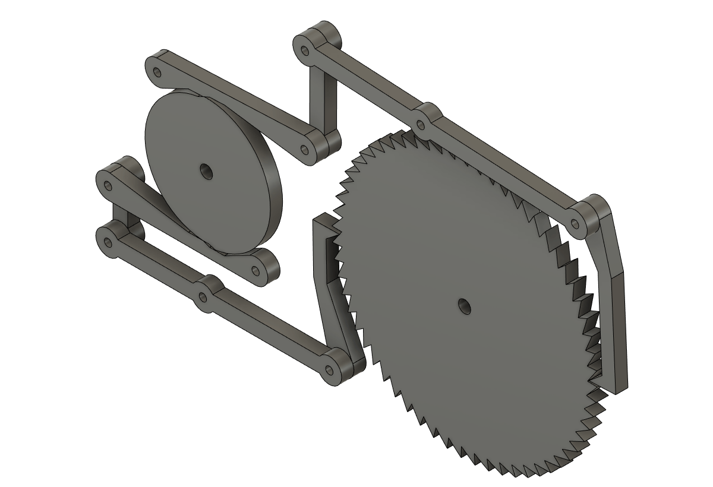
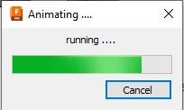

# pyJoints - Installation and Getting Started

**[Home](readme.md)** --
**Getting Started** --
**[Basics](basics.md)** --
**[Inputs](inputs.md)** --
**[Steps](steps.md)** --
**[GIFS](gifs.md)** --
**[Details](details.md)**

On this page we will describe how to Install the pyJoints addIn and run one of the
example scripts.

## Installation

Fork or download and copy the entire contents of this repository into a folder named **pyJoints**
in the Fusion 360 **AddIns** Folder. The AddIns folder can be found at:

- **For Windows**: %appdata%\Autodesk\Autodesk Fusion 360\API\AddIns
- **For macOS**: ~/Library/Application Support/Autodesk/Autodesk Fusion 360/API/AddIns

On Windows %APPDATA% is typically C:\Users\\%USERNAME%\AppData\Roaming, so typically
the Addins folder is **C:\Users\\%USERNAME%\AppData\Roaming\Autodesk\Autodesk Fusion 360\API\AddIns**
based on your User name.

After that, in Fusion360, start the AddIn by pressing **shift-S** (which is the keyboard
shortcut for the Fusion 360 Design:UTILITIES:ADD-INS 'Scripts and AddIns' command), going to
the **'Add-Ins' tab** in the resultant dialog and selecting **pyJoints** and then pressing
the **Run** button.

When you are familiar and confident with pyJoints you can enable the **Run on Startup**
checkbox in this dialog window so that the addIn will start each time you start Fusion 360.

## 1. Open an example pyJoints script

Once the pyJoints addIn is running, navigate to the **Design-ASSEMBLY** submenu
and select the **pyJoints** command. The first time you execute the pyJoints command
you will be presented with the following window:

Press the **'Open pyJoints file ...'** button and you *should* be presented with
a file dialog window positioned at the pyJoints **examples** folder.
*If the file dialog is NOT positioned in the pyJoints example folder
you will need to navigate to the pyJoints AddIn folder, and the examples
folder under that*.

Navigate to the **cam_driven_ratchet** folder and select the **cam_driven_ratchet.pyJoints**
script from that folder.  When you have done so, and pressed the *Open* button in the file
dialog, the addIn command window should change, adding two new slider controls;

## 2. Open associated example Fusion Model (.f3d)

Now execute Fusion's **Open File** comamnd. The pyJoints command window will close
and the Open File command window will be shown. Press the the **Open From My Computer**
button.

Because we just opened the example pyJoints script the resulting file
dialog window *should* be convenently located in the proper directory so all
you need to do is open the **cam_driven_ratchet.f3d** model.  *If the file
dialog is NOT positioned in the correct pyJoints example directory you will
need to navigate to the pyJoints AddIn folder, and the examples/cam_driven_ratchet
folder under that*.  That's why, for these instructions, to make it easier for
you to find the example model, we opened the pyJoints script file before the model,
but the order in which these steps are actually done is not important.

Once you have opened the model you should see something like this:

And we are ready to actually try to run the pyJoints script.

## 3. Run the pyJoints command (again) and run an animation Modally

Now, navigate again to the Design-ASSEMBLY submenu and select the pyJoints command.
It will come up showing the cam_driven_ratchet controls.  **The pyJoints command
remembers the last pyJoints file that was successfully opened** so that you don't
have to select it each time.

When the pyJoints command window comes up again, **press the OK button** and the
model should start moving in a way similar to this:

There will be progress dialog with a cancel button that looks something like
this:

You can move that window out of the way to see the animation better, and
when you are satisfied, press the **Cancel** button to **end the animation**.

## 4. Run an animation Modelessly

You may have noticed several things while running the animation in the
previous section.

- the pyJoints command window was probably covering up part of the model
- you could not move the pyJoints command window because the progress window had focus
- while the animation was running you could not move the model around to look at
  it from different perspectives
- the 'Animating ...' progress dialog came up smack dab in the middle of the
  screen and you had to move it to see the animation

Let's run it again, but this time (psuedo) **Modelessly**.  Once again
(for the third time) navigate to the Design-ASSEMBLY submenu and select
the pyJoints command.  But this time, instead of pressing "OK", press the
**Animate-Run** button (the right pointing triangle next to the word 'Animate').

Now the animation should start, but now you should be able to **move
the pyJoints command window around**, use the 3D Orbit tool or View Cube
to move the model around, and even change the visibility of components
or sketches by clicking on their "eyeballs* in the Fusion Browser outline.

You may also notice that the **step control** in the pyJoints command window
has started counting up from zero and is displaying ever increasing numbers.
You can use the **degreesPerStep** slider to control the speed of the animation,
where there are about 20 steps, or frames, per second, so higher degreesPerStep values
increase the speed and lower ones decrease it.  You can also increase the
**penduumDegrees** slider to a higher number to cause the cam to oscillate
futher on each cycle.

Here's an slo-mo image (0.2 degrees per step), zoomed in on the left
ratchet as it moves the wheel:

When you are satisfied, and ready to move on, press the *Cancel* or
*OK* buttons to close the pyJoints command window.  Note that if you
press OK, the animation will not run Modally (a second time).

There is an important distinction between OK and Cancel that will be
explained more fully later, but generally **once you run a Modeless animation**
pyJoints will **not** run a Modal animation when you press the OK button.
It is not a bug ... it's a feature!

[Next](basics.md) - The [basics](basics.md) of pyJoint scripts ...
