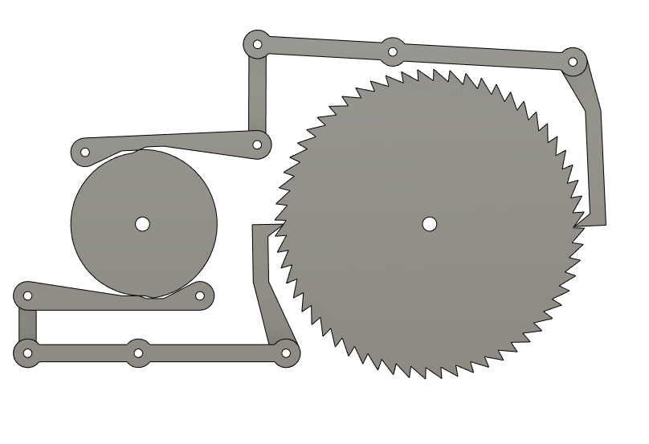

# pyJoints - Creating GIF files from your pyJoints animation

**[Home](readme.md)** --
**[Getting Started](getting_started.md)** --
**[Basics](basics.md)** --
**[Inputs](inputs.md)** --
**[Steps](steps.md)** --
**GIFS** --
**[Details](details.md)**

pyJoints can create **animated GIFS** of an animation created with it.

If setup correctly, in practice it is fairly easy to use.

However, it is worth noting up front that it **depends on an
external python interpreter** and the **installation of the
imageio module** into that python.

*Once again, confession, this is the first python code I ever wrote.
I really didn't want the addIn to get bogged down in the details of
how I **might** install **imageio** into the Fusion 360 python interpreter
and/or provide it as a distributed **library** within my repository.
If **you** see an easy way to do this, and eliminate the dependency
on an external python interpreter, please contact me and explain
how I should do it!!!*

**pyJoints contains an explicit path to a Windows install of Python 3.10**
and uses that path to call python on the **png_to_gifs.py** script in
this repository.  I did not see a quick and easy way to find a path to
an existing python interpreter in *my first week* of python programming
and so there is a major wrinkle here.  Nonetheless, I will describe
the feature first, and then, at the end, re-address the **python path
issue**

## GIF basics

In order for pyJoints to create a GIF from a working pyJoints script,
all of the following must happen:

- you specify a *gif_folder* in your script by calling **setGifFolder()**
  from the initialization section of your script
- you specify a *gif_length* in your script by calling **setGifLength()**
- you check the box labelled **Make GIF** in the pyJoints *command window*
- you **DONT** run a modeless animation by pressing the *Animate **Run** right triangle* buton
  for the given invocation of the pyJoints command, and
- and you press the **OK** button to run a *modal* animation

And then pyJoints will do the following.

- it will call **app.activeViewport.saveAsImageFile(filename, 0, 0)** to
  write a series of PNG files called "frame_NNNNNN.png" where NNNNNN is
  the leading zero packed step (frame) number, to the *gif folder* you specified

- the animation will stop after *gif_length* steps (frames), and then it will

- call **python png_to_gif.py "gif_folder" remove_pngs** to execute the
  **png_to_gif.py** script which converts the PNG files to
  an animated gif and removes the png files.

The resultant GIF files will be called NNNNNN.gif in the gif_folder,
where NNNNNN is a leading zero packed number that guarantees that
previous gif files are not overwritten.

Each gif frame is created at 0.04 seconds, or about 25 frames per second

## GIF Details

We will now explore each of those requirements and actions in more detail

### setGifFolder(path)

**setGifFolder()** is called in your script to set a destination location for the PNG
and GIF files.   The path specified may be **relative** to the *path containing
your pyJoints script* or with an absolute path.  If the path does not exist, it will
(likely) be created.  In my examples it is a subfolder called 'gifs' within
the folder containing the pyJoints script.

	setGifFolder('.\\gifs')
		# relative to the directory containing this file
		# although it could be anywhere

**setGifFolder() must be called from the initialization section** of your script
and use the correct path separators and naming conventions for your machine.

*Note that os.path() is available for use from within your script if you
wanted to make it cross-platform*

### setGifLength(integer)

You call **setGifLength()** to tell pyJoints how long, how many animation steps,
should be in the GIF file.   You could call it with a constant if you know that
your animation loops after a certain number of frames, but I have found the need
to call it in the *step section* of the script because my examples vary the
*period* of the animation, so in order to capture one full cycle
you will see the following in my *cam_driven_ratchet* example:

	setGifLength(2 * period_degrees / per_step)
		# Set the length of the gif (one full cycle)
		# after we know the final input values.
		# We update the value every time through the loop.
		# but it will be static for all intents and purposes
		# in the onCommandExecute::doAnimation() method

### check the box and DONT run a modeless animation

GIFS are created when the box is checked and the modal doAnimation()
method is called from command.onCommandExecute().  If you
run a modeless animation from the pyJoints command window,
command.onCommandExecute() will not be called.  Therefore you
**must** check the box and you **must not** run a modeless
animation if you want to make a GIF.

That's pretty much it.  All of the animations shown on these
help pages were made using this feature.

## Back to the python path issue

If your python is in a different location you may call **setPytgonPath()**
from your pyJoints script to tell pyJoints where it is.  Your python
**must have imageio installed**.

Once again, I'm new to python.  But it was pretty simple for me to get
this to work.  I simply did the following:

- **installed** the most current version of **python** for Windows using the installation defaults
- opened a dos-box (command window) and typed **pip install imageio**

and voila!! I had an externally callable python with imageio :-)

I then ferreted out where the python interpreter was located.
On my machine that turned out to be:

	os.environ['USERPROFILE'] + '\\AppData\\Local\\Programs\\Python\\Python310\\python.exe'

I hope you can figure this out, and that perhaps someone can let me
know a better way to do this.

But for now, I'm done!

[Finally](details.md) - final detailed notes, issues, and things to do ...
