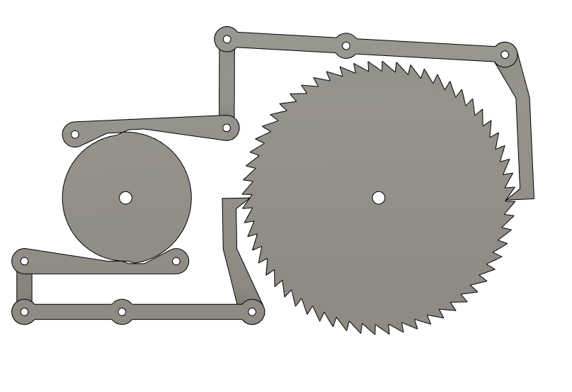

# pyJoints - an AddIn to animate joints in Fusion 360

**Home** --
**[Getting Started](getting_started.md)** --
**[Basics](basics.md)** --
**[Inputs](inputs.md)** --
**[Steps](steps.md)** --
**[GIFS](gifs.md)** --
**[Details](details.md)**

This Fusion360 AddIn allows you to **animate joints and their
relationships** using relatively simple scripts written in Python.
It also facilitates the process of creating **animated GIFs**, like
the one below, from those scripts.

When this AddIn is installed and running **the pyJoints command** will be
found in the Fusion 360 **Design-ASSEMBLE** drop-down menu.

You can learn more on the following pages:

- **[Getting Started](getting_started.md)** - Installing the AddIn and running an example pyJoints script
- **[Basics](basics.md)** - Basic structure of a pyJoints script
- **[Inputs](inputs.md)** - Creating inputs and initializing your animation
- **[Steps](steps.md)** - Programming the animation vis the global **step** variable
- **[GIFS](gifs.md)** - How to create animated GIFs from your pyJoints script
- **[Details](details.md)** - Detailed Notes and Advanced Topics

## Motivation

This addIn was written because I had difficulty using the existing
features in Fusion360, including *contact sets*, *tangent relationships*,
*motion links*, *motion studies*, and/or the entire Fusion 360 *Animation*
and *Simulation* 'products' to model the motion of a electromagnetic driven
pendulum wooden geared clock that I was designing.

If you are trying to model the motion of a machine that you have designed
in Fusion 360 and are having similar difficulties ... that the provided
features are too simple, don't work well, or just simply don't do
what you need ... then perhaps this AddIn can help you.

## pyJoints vs existing Fusion 360 features

When using pyJoints, one **relies** on Fusion to model the
basic relationship between joints where they are **determinate**.
By **determinate** I mean joints that are **constrained**
by, or **dependent** on the positions of other joints in the model
due to the inferred physical coupling in the design.

You don't animate every joint in the model.  You only
animate certain joints that *drive* the other ones.

Apart from this basic *inferred physical coupling*,
Fusion provides a number of other ways to couple
joints, including *motion links*, *tangental relationships*,
and *contact sets*.

Although I specifically wrote this addIn because I had
problems using those other ways of coupling joints in
Fusion, that does not mean that they are 'bad', or should
not be used.  In fact, if one of those ways of coupling
joints works for you then it is very likely that you
should use it.

pyJoints is intended for the cases where those provided
mechanisms **don't work** well, like for instance, when
*tangental relationships* get **wonky** or Fusion refuses
to create them for the two faces you want to stay in touch,
or when *contact sets* and/or *motion links* just seem to
**freeze** your model and stop anything from working correctly,

Apart from that, or rather, in addition, if your model is otherwise
working well, pyJoints can provide something besides the
limited *Animate Joint Relationships* command, the difficult
to use (and frankly weird and very limited) *Motion Study*, or the
*Animation Product* ... which doesn't even respect the joints
you've so carefully crafted, in order to **animate
your model** and/or **capture GIF animations** of it in motion.

That's when **pyJoints** might prove to be useful.

I hope you give it a try!!

## License

## Credits

[Next](getting_started.md) - [Getting started](basics.md) with pyJoints ...
